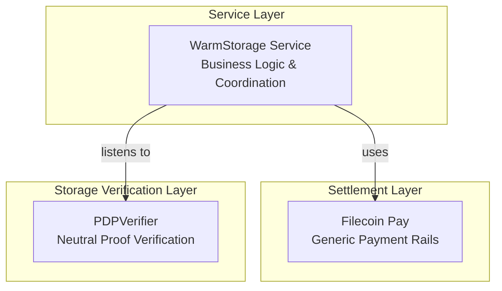

**The Filecoin Onchain Cloud (FOC)** redefines the Filecoin Network as a **modular, programmable cloud platform** — a decentralized infrastructure where storage, retrieval, and payments are managed entirely through onchain smart contracts.

It transforms Filecoin from a large-scale data storage marketplace into a verifiable service layer, where every operation — storing data, proving retention, or settling a payment — is **transparent, auditable, and automated**.

## Core Data Model

Filecoin Onchain Cloud models both data operations and economic interactions as verifiable onchain entities.

Together, these entities define how information, proofs, and payments move through the system — forming the foundation of Filecoin’s verifiable cloud.

| Concept	| Purpose |
|---------|---------|
| **Piece** | Smallest data unit stored in the Filecoin network. |
| **Data Set** |	Logical collection of stored data pieces with a shared lifecycle.|
| **Proof Record**	| Verifiable claim proving continued possession of data. |
| **Payment Rail** |	Economic channel defining how and when payments are released. |

#### **Piece**

A Piece is the smallest unit of content stored in the Filecoin network. Each piece is identified by a **Content Identifier (CID)** and represents a verifiable reference to raw data, independent of its physical location.

#### **Data Set**

A data set represents a logical grouping of one or more Pieces of content which will be stored and proved by PDP service providers.

When a client uploads data via the **Filecoin Warm Storage Service (FWSS)**, the service contract registers a new data set and links it to a **Payment Rail** that defines its settlement conditions.

Each data set becomes a persistent, onchain-tracked object — tied to:

- its pieces (content CIDs),
- its service provider,
- and its proof schedule under PDP.

#### **Proof Record**

A Proof Record captures the cryptographic evidence that a PDP Service Provider still holds the data in a data set. Proofs are generated periodically using **Proof of Data Possession (PDP)** — a lightweight cryptographic protocol optimized for verifiable warm storage.

Each Proof Record:

- Is submitted onchain by the provider.
- Includes a timestamp, data set reference, and proof hash.
- Is automatically verified and recorded by the service contract.

These records create a **public, immutable audit trail** of data set availability, enabling anyone to verify that data remains online without re-downloading it. Proof Records also act as **payment triggers**, signaling Filecoin Pay to settle balances once proofs succeed.

#### **Payment Rail**

A Payment Rail defines the financial lifecycle of the Filecoin Onchain Cloud service agreement. It connects a **client** (who requests a service) with a **provider** (who delivers it), and governs how tokens move between them based on onchain verifiable conditions.

Rails are token-agnostic, supporting FIL, stablecoins, or ERC-20 tokens, and every transaction is recorded onchain for transparency.

## Architecture

The Filecoin Onchain Cloud is structured as a multi-layered system, separating verifiability, execution, and user interaction.

This modularity allows each layer to evolve independently while maintaining interoperability through onchain standards.

| Layer | Function | Components |
|-------|------------|----------|
| **Verification Layer** | Guarantees the correctness and transparency of all storage operations. | **Proof of Data Possession (PDP)** |
| **Settlement Layer** | Handles programmable payments, rails settlement. | **Filecoin Pay** |
| **Storage & Retrieval Service Layer** | Executes fast, retrievable, verifiable data operations. | **Filecoin Warm Storage Service (FWSS)**, **Filecoin Beam**. |
| **Developer Layer** | Exposes unified APIs and SDKs for interaction. | **Synapse SDK**, Filecoin Pin |

### Service Contracts

At the heart of the Filecoin Onchain Cloud are **Service Contracts** — modular, upgradable smart contracts that define and manage the behavior of each onchain service.
Service Contracts serve the same purpose as “microservices” in conventional cloud infrastructure, but are transparent, forkable, and verifiable.

Each contract:

- Defines the logic for one service (e.g., storage, retrieval, payment).
- Manages its own state — data sets, providers, balances, and proofs.
- Exposes a standard interface for cross-service interaction.
- Emits events that allow public auditing and monitoring.

Because Service Contracts are deployed on the Filecoin Virtual Machine, they can be composed together — enabling new service types and hybrid functionalities without central coordination.

### Proof of Data Possession (PDP)

PDP is a cryptographic protocol that allows storage providers to prove they possess your data **without revealing the data itself**. The system uses randomized challenges and Merkle proofs to verify storage continuously, with all verification happening on-chain.

**Key benefits:**

- Cryptographically verifiable storage
- Small proofs for large data
- Continuous verification (not one-time)

[Learn more about PDP →](/core-concepts/pdp-overview)

### Payment Rails and Lockup

Payment rails are **automated payment channels** that stream tokens from clients to providers at a specified rate (e.g., 100 USDFC/epoch). The lockup mechanism ensures providers get paid even if clients abandon their accounts by reserving funds for a guaranteed period.

[Learn more about Filecoin Pay →](/core-concepts/filecoin-pay-overview)

### Filecoin Warm Storage Service

Filecoin Warm Storage Service is the **business logic layer** that combines PDP verification with payment rails. It handles client authentication, payment coordination, pricing, metadata management, and fault handling.

Service providers run Curio nodes that store data, submit proofs, and provide HTTP APIs for upload/download.

[Learn more about Filecoin Warm Storage Service →](/core-concepts/fwss-overview)

## Next Steps

Now that you understand the architecture, you can start building on Filecoin Onchain Cloud.

- [**Developer Guides**](/developer-guides) - Build with the SDK
