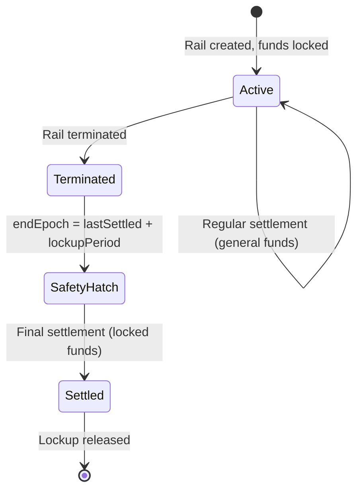
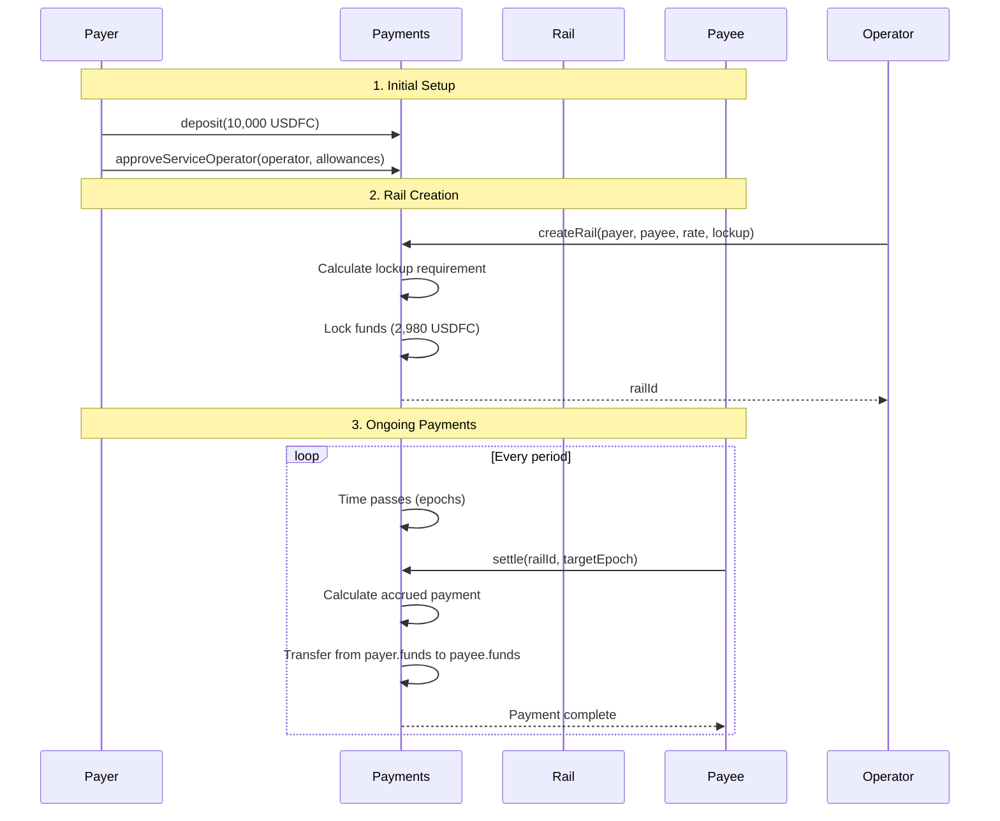
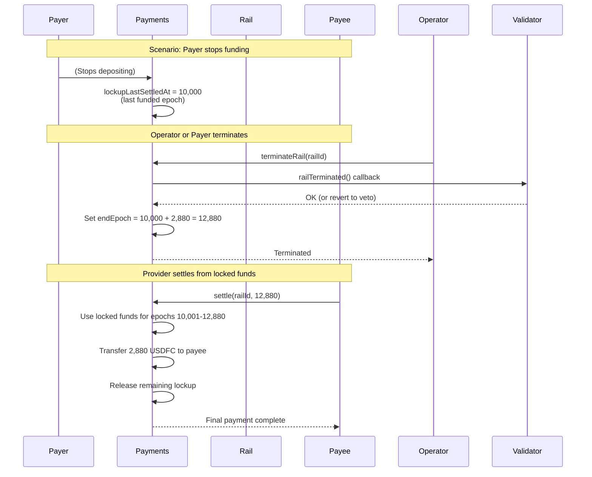

As the economic core of the Filecoin Onchain Cloud (FOC), **Filecoin Pay** embeds **financial logic directly into on-chain contracts**, ensuring that providers receive funds only when they deliver verifiable service, and clients pay only when conditions are met.

With Filecoin Pay, service economics become as **transparent and composable** as the data services they underpin, enabling the Filecoin network to operate not just as a storage market but as a fully programmable cloud economy.


## What is Filecoin Pay?

In the Filecoin Onchain Cloud architecture, services (storage, retrieval) must be paired with economic incentives. Without a robust, verifiable settlement layer, the system risks:

- Providers performing work without guaranteed payment.
- Clients paying upfront without verifiable service delivery.
- Opaque billing and trust-based relationships that undermine decentralisation.


Filecoin Pay addresses these risks by tying **service delivery** (e.g., proofs of data possession, retrieval success) to **on-chain payment flows** that lets services run automated, controllable payment “rails” between a payer and a payee. It supports:

- **Token-agnostic billing**: support for FIL, stablecoins, ERC-20 tokens.
- **Trustless settlement**: payments only release once proofs or events trigger them.
- **Composability**: payment rails become modular primitives that other services build on.
- **Transparency & auditability**: every rail, deposit, payout and event is discoverable on-chain.

At its core, Filecoin Pay makes future payment guarantees explicit via lockups and enforces them in the contract’s accounting, so participants can reason clearly about risk, solvency, and termination behavior.

## How Filecoin Pay works
The Filecoin Pay smart contract enables ERC20 token payment flows through "rails" - enables automatic, verifiable, programmable settlement between users and service providers on the Filecoin Onchain Cloud.

At its core, Filecoin Pay works by:

- Holding user funds in **escrow using ERC-20 or FIL tokens**
- Creating a **Payment Rail** that defines how and when money moves
- Delegating execution to an **Operator**, who runs payment logic automatically
- Allowing **Validators** (on-chain service contracts or actors) to trigger or authorize payments based on verified service outcomes (e.g., PDP proofs)

### Core Building Blocks

#### **Account**
Represents the client’s funds allocated for a service.
- Holds balances in **FIL or ERC-20 tokens**
- Controlled by the user, not the provider
- Can be topped up, withdrawn, and managed through smart contracts

#### **Payment Rail**: 
A **automatic settlement channel** between a user and a provider for a specific service or data set. Payer ↔ Payee pairs can have multiple payment rails between them but they can also reuse the same rail across multiple deals. 

Each rail defines:
- `token`: FIL, stablecoin, ERC-20
- `payer` & `payee`: clients & service providers
- `operator` & `validator` 
- `paymentRate`: tokens per epoch
- `lockupPeriod`： epochs of guaranteed cover after termination
- `lockupFixed`: pool for one-time payments
- `endEpoch`: Final epoch up to which the rail can be settled

#### **Operator**
**Trusted smart contract** or entity that manages rails on behalf of payers with caps. A payer must explicitly approve an operator and grant it specific allowances, which act as a budget for how much the operator can spend or lock up on the payer's behalf.

The operator sometimes referred to as the "**service contract**", such as Filecoin Warm Storage Service, and File Beam CND service, etc. 

**Capabilities** of an approved operator: create rails, modify rail terms (rate, lockup), settle payments, terminate rails, execute one-time payments

#### **Validator**
A validator is an optional contract that acts as a trusted arbitrator for a rail. Its primary role is to validate payments during settlement, but it also plays a crucial part in the rail's lifecycle, especially during termination.

**Capabilities**: 
- **Validate settlements**: Adjust payment amounts during settlement
- **Veto terminations**: Block rail termination attempts
- **Decide final payout**: Determine total payout after termination

### Lockup Mechanism
Each payment rail can be configured to require the payer to lock funds to guarantee future payments. The lockup mechanism ensures providers get paid even if clients abandon their accounts. It's a **safety guarantee**, not a pre-payment.

This lockup is composed of two distinct components:

**Streaming Lockup** = `paymentRate × lockupPeriod`

- Guarantees provider payment for the lockup period
- Example: 1 USDFC/epoch × 2,880 epochs (1 day) = 2,880 USDFC locked
- During normal operation: Acts as minimum balance, payments from general funds
- After termination: Safety hatch activates, provider can settle from locked funds

**Fixed Lockup** = `lockupFixed`

- Reserved pool for one-time payments
- Drawn directly when immediate payments needed
- Reduced as payments are made

## Payment Flow
The life circle of a payment rail. 

1) **Funding and approvals**
   
   Deposit ERC-20 or FIL into the payer’s internal account

2) **Rail creation and configuration**
   - Operator `createRail` & Configure lockups via `modifyRailLockup`
   - Start/adjust streaming via `modifyRailPayment`

3) **Settlement** 
   - Active rails: can only settle up to payer’s `lockupLastSettledAt`
   - Terminated rails: can settle up to `endEpoch` using the streaming lockup

4) **Termination and finalization**
   - Operator can terminate anytime; payer can terminate only if fully funded.
   - One-time payment window: `lockupFixed` remains spendable until `endEpoch`; leftover is refunded to payer at finalization.
   - After settlement reaches `endEpoch`, the rail is finalized and zeroed; operator usage is released.

5) **Escape hatch**
   
   If a validator malfunctions, the payer can pay in full for the guaranteed window and unlock funds.

**Normal Operation** (before termination): Payments flow from general account funds, lockup remains untouched.

**Safety Hatch** (after termination): Provider can settle up to `endEpoch` using locked funds, even if client account is empty.




**Example**:

```
Rail: 1 USDFC/epoch, 2,880 epoch lockup period
Terminated at epoch 10,000
Provider can settle through epoch 12,880 using the 2,880 USDFC lockup
This guarantees payment even if client disappears
```

### Normal Operation (Active Rail)



### Termination and Safety Hatch



## Security Properties

**Safety Guarantees**:

- **Lockup protection**: Providers guaranteed payment for lockup period even after termination
- **Allowance limits**: Payers control operator spending through rate, lockup, and period caps
- **Validator mediation**: Optional third-party arbitration for disputes
- **No double-spend**: On-chain accounting prevents payment manipulation

**Trust Model**:

- Payers trust approved operators to create fair rails
- Providers trust lockup mechanism for payment guarantees
- Both parties can optionally trust validators for dispute resolution
- All trust relationships are explicit and on-chain

## Summary

Filecoin Pay provides **generic payment infrastructure** for automated service payments through configurable payment channels (rails).

- **Core Components**: Accounts (fund storage), Rails (payment channels), Operators (service contracts), Validators (optional arbitrators)

- **Key Innovation**: Lockup safety hatch guarantees provider payment even if clients abandon accounts
