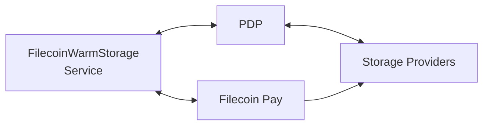

**Filecoin Warm Storage Service (FWSS)** is designed to provide a serviceable, verifiable data‐storage tier within the Filecoin Onchain Cloud, positioned between traditional cold archival storage and ultra‐hot caching.

## What is FWSS?

**Filecoin Warm Storage Service (FWSS)** enables data sets to be stored, verified, retrieved and billed in a live fashion: providers continuously demonstrate possession (via PDP), clients access data with lower latency, and payments are triggered via on-chain service contracts.

This service transforms Filecoin from an archival storage network into a data service layer suitable for real-time applications, analytics, and content-heavy workflows.

**Filecoin Warm Storage Service** also represents a complete implementation of the Filecoin Onchain Cloud stack, demonstrating how to combine PDP and the Filecoin Pay contracts to create a marketplace for warm storage with instant retrieval guarantees powered by FilBeam.

**FWSS** refers to data that needs to be:

- ✅ **Accessible**: Available for fast storage and retrieval
- ✅ **Verified**: Continuous verifiability with cryptographically proven
- ✅ **Affordable**: Less expensive than "hot" (CDN) storage
- ✅ **Reliable**: Integration with onchain payment rail using Filecoin Pay

Together, FWSS enables builders to depend on Filecoin not only for “store and forget,” but for “store and serve” in a verifiable, programmable manner.

#### **Core Responsibilities**

WarmStorage manages the complete storage marketplace:

1. **Client Authentication**: Validates all client operations via EIP-712 signaturess.
2. **Payment Coordination**: Automatically creates and manages payment rails between clients and service providers.
3. **Cost Calculation**: Determines pricing based on size, duration, and CDN usage.
4. **Metadata Management**: Stores data set and piece metadata for discovery.
5. **Fault Handling**: Integrates PDP verification results with payment adjustments

## How FWSS works

**Filecoin Warm Storage Service (FWSS)** combines PDP (Proof of Data Possession) verification with integrated payment rails using Filecoin Pay to offer data set management for developers.



### PDP Integration (_`PDPListener`_)

The Filecoin Warm Storage Service integrates with the **Proof of Data Possession (PDP)** protocol to enable verifiable, continuous data availability on Filecoin Onchain Cloud. This integration enables automatic payment rail management based on storage operations.

- **Validate storage operations**: Ensure only authorized clients create data sets
- **Track data lifecycle**: Monitor when pieces are added and managed
- **Enforce service quality**: Receive proof results to trigger payment adjustments
- **Maintain accountability**: Respond to proof failures by applying penalties

Using the callback design pattern, FWSS implements `PDPListener` to receive events from `PDPVerifier` to extend the logics for the complete lifecycle of data sets.

```solidity
interface PDPListener {
    function dataSetCreated(uint256 dataSetId, address creator, bytes calldata extraData);
    function piecesAdded(uint256 dataSetId, uint256 firstAdded, Cids.Cid[] memory pieceData, bytes calldata extraData);
    function possessionProven(uint256 dataSetId, uint256 challengedLeafCount, uint256 seed, uint256 challengeCount);
    function nextProvingPeriod(uint256 dataSetId, uint256 challengeEpoch, uint256 leafCount, bytes calldata extraData);
}
```

##### _`dataSetCreated()`_

When a new data set is created in `PDPVerifier`, this function is called to set up payment infrastructure and validate the client operation.

**Key actions**:

1. **Signature validation**: Ensure client authorized this operation
2. **Operator check**: Verify client has approved WarmStorage
3. **Metadata storage**: Save data set metadata (category, project, etc.)
4. **Payment rail creation**: Establish automated payment channel

##### _`piecesAdded()`_

When pieces are added to an existing data set, this function is called to store piece metadata and update payment rail configuration if needed.

**Key actions for first data set**:

- Payment rail creation deferred to first piece upload
- Enables data sets without immediate storage

##### _`possessionProven()`_

When a storage provider successfully completes a proof verification, this function is called to record the successful proof completion.

##### _`nextProvingPeriod()`_

When a proof window expires without a valid proof (indicating a fault), this function is called to handle the failure and apply penalties.

### Filecoin Pay Integration ( _`IValidator`_)

Filecoin Warm Storage Service implements the `IValidator` interface from **Filecoin Pay** to act as payment **validator** to manage payment rails for different service types, implementing dynamic rate calculation and fault-based arbitration.

- Reduce payments when proofs fail
- Apply penalties for repeated faults
- Terminate rails after fault thresholds
- Implement custom SLA enforcement
- Pay only for proven epochs

This integration allows the service layer to automatically enforce quality of service through payment adjustments.

### Service Specific Logic

Beyond the PDP and Filecoin Pay integrations, FWSS implements critical business logic that orchestrates the entire warm storage marketplace. These service-specific components handle the operational lifecycle from service provider onboarding to automated billing, ensuring quality control, security, and seamless payment coordination across all data management operations.

The key areas of service-specific logic include:

- **Provider registration and approval workflow**: Curated whitelist management for quality assurance in `ServiceProviderRegistry.sol`.
- **Client data set creation with CDN integration options**: Flexible storage tier selection and configuration
- **Automated cost calculation**: Dynamic pricing based on data size, duration, and service tiers

#### Two-Tier Pricing

**Base Storage**:

price: `2.5 USDFC per TiB per month`

- Standard storage with HTTP access
- Retrieval latency: seconds to minutes
- Lower cost, suitable for most use cases

**CDN Storage**:

price: `14 USDFC per TiB of egress used`

- Egress usage-based pricing
  - Tracked and managed via FilBeam operator.
  - Charged separately from base storage.
  - learn more about [FilBeam](https://docs.filbeam.com/)
- Content Delivery Network backed
- Retrieval latency: milliseconds
- Higher cost, for performance-critical data

:::note
**FWSS Lockup Model:**  
FWSS uses a simple fixed lockup: you always prepay for 30 days of active service. 

If your balance drops below this threshold, you risk default—at which point the service provider may begin removing your data. There is no variable lockup or complex collateral calculation: just keep your balance above 30 days to avoid disruption.
:::

## Summary

FWSS enables the Filecoin Onchain Cloud to behave not just as a passive archive, but as a live data service:

- Storage providers are continuously verified via PDP
- Clients gain access to retrievable, service‐ready data
- Payments are automated via onchain rails linked to proof events

By linking upload, proof, retrieval, and payment, FWSS delivers cloud-style storage with blockchain‐grade guarantees.
