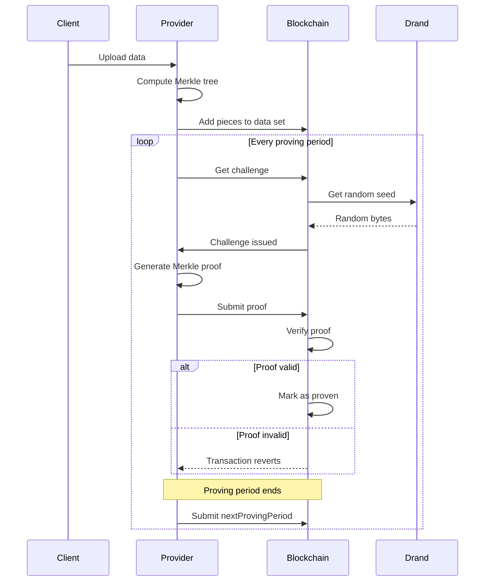
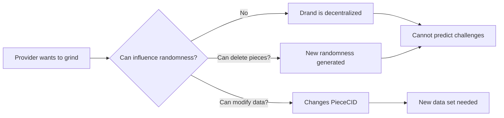

This page explains **Proof of Data Possession (PDP)**, the cryptographic protocol which ensures every data set stored within the **Filecoin Onchain Cloud (FOC)** remains accessible, verifiable, and provably intact without re-uploading the full data.

:::tip[Architecture Integration]
This page focuses on the PDP protocol details. To understand how PDP integrates with the overall system architecture, see [**System Architecture**](/core-concepts/architecture).
:::

## What is PDP?

**Proof of Data Possession (PDP)** is a cryptographic protocol that allows a client or smart contract to verify that a storage provider still holds a data set, without downloading it again.

In simple terms — PDP asks a provider to prove they still have the data by responding correctly to a randomized challenge generated from that data.
If the provider no longer stores the content, they cannot produce a valid proof.

This mechanism provides the verifiable heartbeat of Filecoin Onchain Cloud — proving that storage agreements are being honored in real time. It is the key that allows Filecoin to evolve from _cold archival storage_ to a **programmable cloud service layer** with fast data storage and retrival.
It introduces trustless verifiability for short-term and live data use cases, enabling new service types like **Filecoin Warm Storage, Filecoin Pin, and Onchain Data Hosting**, etc.

PDP provides three essential guarantees:

- **🧩 Integrity** — The data has not been altered or replaced.
- **🌐 Availability** — The data is physically present and retrievable when challenged.
- **⚖️ Accountability** — Payments and service reputation are tied to verifiable proofs, not promises.

Every proof strengthens confidence that the Filecoin Onchain Cloud behaves like a reliable Web2-grade cloud, but with **onchain transparency and cryptographic verifiablity**.

## How PDP Works

At its core, PDP is a **challenge-response** protocol based on deterministic cryptography and verifiable computation.

Each verification cycle follows these steps:



#### **Step-by-step Summary:**

1. **Data Upload**: The Client uploads file in a data set to a PDP-enabled Service Provider which will stores the file, and add piece in the data set with the PDP contract onchain.

2. **Challenge Creation**: The PDP contract generates a randomized challenge based on the drand beacon and data set ID.

3. **Proof Generation**: The Service Provider computes a a Merkle inclusion proof using a subset of the stored data blocks determined by the challenge.

4. **Onchain Verification**: The PDP contract recomputes the challenge and checks that the proof corresponds to the expected Merkle root or commitment.

5. **Result & Settlement**: A successful verification emits an onchain event, which other contracts — such as Warm Storage Service — to track performance and use Filecoin Pay to release funds through the corresponding Payment Rail.

6. **Period Advancement**: After the proving period, the provider calls `nextProvingPeriod` on the PDP contract to advance to the next proving period.

Each successful PDP round is a verifiable heartbeat proving that the data set is still alive within the Onchain Cloud.

## Implementation Summary

The [PDP smart contracts repo](https://github.com/FilOzone/pdp) provides a reference implementation designed for integration within the Filecoin Onchain Cloud.

### Core Components

#### Piece

**Piece**: A unit of data stored in the system (typically one file)

```solidity
struct Piece {
    uint64 id;          // Unique within data set
    Cids.Cid data;      // PieceCID (32-byte digest)
    uint256 size;       // Must be multiple of 32 bytes
}
```

**PieceCID (CommP)**: Merkle root of the piece's data

- Calculated using binary Merkle tree
- Each leaf = 32 bytes of data
- Last 32 bytes of v2 CID = the digest used on-chain

#### Data Set

A data set represents a logical grouping of one or more Pieces of content which will be stored and proved by PDP service providers.

```solidity
struct DataSet {
    uint64 id;
    uint64 challengeDelay;      // Epochs between proofs
    uint64 nextPieceID;         // Sequence number
    Piece[] pieces;             // Array of pieces
    uint256 totalSize;          // Total bytes
    uint256 nextChallengeEpoch; // When next challenge available
}
```

**Properties**:

- One data set per client-provider relationship
- Contains multiple pieces (files)
- Each piece has PieceCID + size
- Subject to periodic challenges

#### Proof

Each proof certifies the inclusion of a leaf at a specified position within a Merkle tree:

```solidity
struct Proof {
    leaf: bytes32,
    leafOffset: uint,
    proof: bytes32[],
}
```

#### PDPVerifier Contract

The main contract that holds data sets and verifies proofs.

**Responsibilities**:

- Create and manage data sets on-chain
- Generate randomized challenges using Filecoin's drand beacon [singleton contract](https://github.com/filecoin-project/FIPs/blob/master/FIPS/fip-0095.md)
- Verify Merkle proofs submitted by providers
- Call listener contracts on events (creation, additions, faults)
- No business logic or payment handling

#### PDPListener Contract

The listener contract is a design pattern allowing for extensibile programmability of the PDP storage protocol. Itcoordinates a concrete storage agreement between a storage client and provider using the PDPVerifier's proving service.

**Responsibilities**:

- **Fault handling**: Reports faults when proving fails
- **Proving period management**: Manages the timing of proof challenges
- **Challenge window implementation**: Enforces time constraints for proof submission

### Security Properties

#### Soundness & Completeness

**Property**: Provider cannot fake proof without actually having the data so honest provider with data can always generate valid proof.

- Merkle tree is cryptographically binding & Merkle proof generation is deterministic
- Cannot compute root without all leaves
- Cannot predict which leaf will be challenged (randomness)
- Grinding attacks prevented (see below)

**Attack resistance**:

- ❌ Cannot pre-compute proofs (unknown challenges)
- ❌ Cannot fake proofs (hash collision resistant)
- ❌ Cannot grind randomness (drand is unpredictable)

#### Unpredictability

**Property**: Provider cannot predict future challenges

**Randomness guarantees**:

- Drand beacon is decentralized (League of Entropy)
- Randomness revealed only at challenge epoch
- No single entity controls randomness
- Verifiable random function (VRF) based

**Grinding prevention**:



## Summary

The **Proof of Data Possession (PDP)** protocol is the fast storage & verifiability backbone of Filecoin Onchain Cloud.

It ensures that:

- Every data set is cryptographically registered and continuously verified.
- Providers cannot fake data possession — they must prove it.
- Payments and service continuity are tied to cryptographic proofs.

By embedding PDP into every service, Filecoin Onchain Cloud delivers **programmable, verifiable storage** — where data isn’t just stored, it’s **provably alive**.
