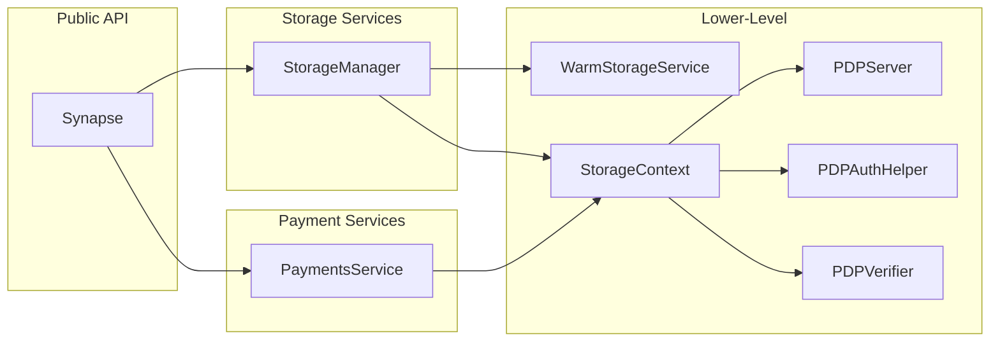
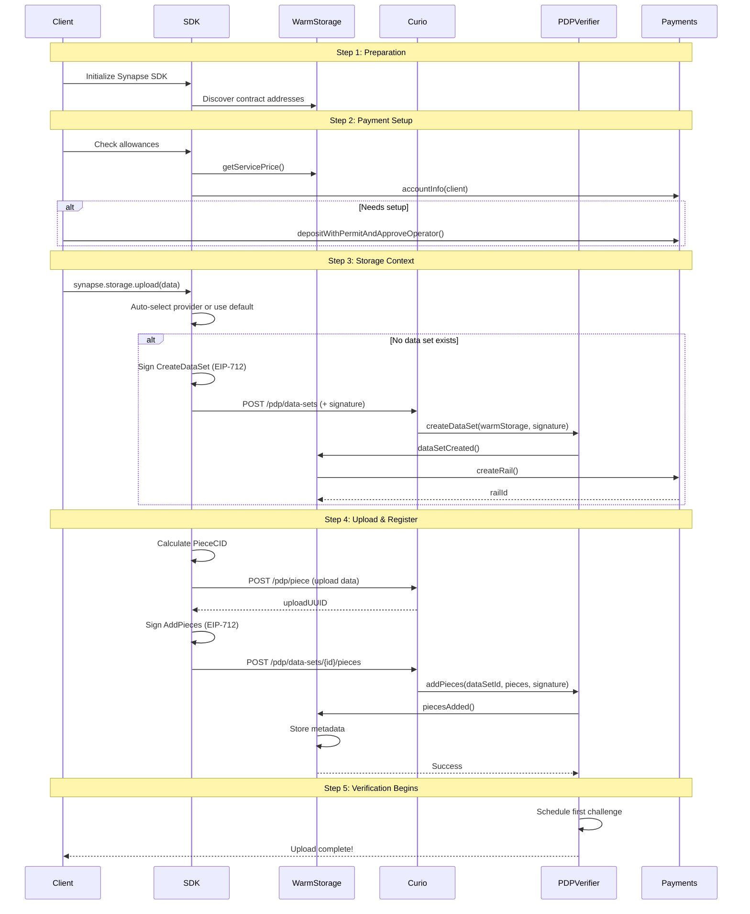

This page describes the components of the Synapse SDK and how they work together. You'll learn how each component can be used independently, how they are organized within the SDK architecture, and how they interact with the underlying smart contracts and storage providers.

The SDK is built from these core components:

- **`Synapse`** - Main SDK entry point with simple, high-level API
- **`PaymentsService`** - SDK client for managing deposits, approvals, and payment rails (interacts with Filecoin Pay contract)
- **`StorageManager`**, **`StorageContext`** - Storage operation classes
- **`WarmStorageService`** - SDK client for storage coordination and pricing (interacts with WarmStorage contract)
- **`PDPVerifier`** - Client for PDPVerifier contract - get data set and piece status, create data sets and add pieces
- **`PDPServer`** - HTTP client for Curio providers - create data sets and add pieces
- **`PDPAuthHelper`** - Signature generation utility - Generate EIP-712 signatures for authenticated operations (create data sets and add pieces)

The following diagram illustrates how these components relate to each other and the external systems they interact with:



The SDK architecture is guided by several key principles that ensure maintainability, flexibility, and ease of use:

**Design Principles**:

- **Separation of Concerns**: Protocol, business logic, and application layers are distinct
- **Composability**: Each component can be used independently or together
- **Abstraction**: SDK hides blockchain complexity from applications
- **Verification**: All storage backed by cryptographic proofs

## SDK Components

The SDK is organized into three layers, each serving a specific purpose:

- **High-Level API**: The `Synapse` class provides a simple interface for common operations.
- **Service Layer**: `PaymentsService` and `StorageManager` handle domain-specific logic.
- **Lower-Level Clients**: Direct access to contracts and providers for advanced use cases.

### Synapse

**Purpose**: Main SDK entry point with simple, high-level API

**API Reference**: [Synapse API Reference](/api/filoz/synapse-sdk/synapse/classes/synapse/)

**Synapse Interface**:

```ts twoslash
import {
  Synapse,
  SynapseOptions,
  StorageInfo,
  ProviderInfo,
  FilecoinNetworkType,
} from "@filoz/synapse-sdk";
import { ethers } from "ethers";
import type { PaymentsService, StorageManager } from "@filoz/synapse-sdk";
// ---cut---
interface SynapseAPI {
  // Create a new Synapse instance
  create(options: SynapseOptions): Promise<Synapse>;
  // Properties
  payments: PaymentsService;
  storage: StorageManager;
  // Storage Information (pricing, providers, service parameters, allowances)
  getStorageInfo(): Promise<StorageInfo>;
  getProviderInfo(providerAddress: string): Promise<ProviderInfo>;
  // Network Information
  getNetwork(): FilecoinNetworkType;
  getChainId(): number;
  // Contract Addresses
  getWarmStorageAddress(): string;
  getPaymentsAddress(): string;
  getPDPVerifierAddress(): string;
  // Ethers Helpers
  getProvider(): ethers.Provider;
  getSigner(): ethers.Signer;
}
```

### PaymentsService

The PaymentsService provides direct access to the Filecoin Pay contract, enabling you to:

- Manage token deposits and withdrawals
- Approve operators for automated payments
- Query and settle payment rails
- Monitor account health and balance

This is your primary interface for all payment-related operations in the SDK.

**API Reference**: [PaymentsService API Reference](/api/filoz/synapse-sdk/synapse/classes/paymentsservice/)

Check out the [Payment Operations](/developer-guides/payments) guide for more details.

**Payments Service Interface**:

```ts twoslash
import {
  RailInfo,
  TokenIdentifier,
  TokenAmount,
  DepositOptions,
  PaymentsService,
  SettlementResult,
} from "@filoz/synapse-sdk";
import { ethers } from "ethers";
import { TOKENS } from "@filoz/synapse-sdk";
interface AccountInfo {
  funds: bigint;
  lockupCurrent: bigint;
  lockupRate: bigint;
  lockupLastSettledAt: bigint;
  availableFunds: bigint;
}
interface ServiceApproval {
  isApproved: boolean;
  rateAllowance: bigint;
  rateUsed: bigint;
  lockupAllowance: bigint;
  lockupUsed: bigint;
  maxLockupPeriod: bigint;
}
type Transaction = Promise<ethers.TransactionResponse>;
type Rail = {
  token: string;
  from: string;
  to: string;
  operator: string;
  validator: string;
  paymentRate: bigint;
  lockupPeriod: bigint;
  lockupFixed: bigint;
  settledUpTo: bigint;
  endEpoch: bigint;
  commissionRateBps: bigint;
  serviceFeeRecipient: string;
};
// ---cut---
interface PaymentsServiceAPI {
  // Balances
  walletBalance(token: TokenIdentifier): Promise<bigint>;
  balance(): Promise<bigint>;
  accountInfo(token: TokenIdentifier): Promise<AccountInfo>;

  // Token Operations
  decimals(token: TokenIdentifier): number;
  allowance(spender: string, token: TokenIdentifier): Promise<bigint>;
  approve(spender: string, amount: TokenAmount): Transaction;
  // Deposits
  deposit(amount: TokenAmount): Transaction;
  depositWithPermit(amount: TokenAmount): Transaction;
  depositWithPermitAndApproveOperator(
    amount: TokenAmount,
    operator: string,
    rateAllowance: TokenAmount,
    lockupAllowance: TokenAmount,
    maxLockupPeriod: TokenAmount
  ): Transaction;

  // Operator management
  approveService(
    service: string,
    rateAllowance: TokenAmount,
    lockupAllowance: TokenAmount,
    maxLockupPeriod: TokenAmount,
    token: TokenIdentifier
  ): Transaction;
  revokeService(service: string, token: TokenIdentifier): Transaction;
  serviceApproval(service: string): Promise<ServiceApproval>;

  // Rails
  getRailsAsPayer(): Promise<RailInfo[]>;
  getRailsAsPayee(): Promise<RailInfo[]>;
  getRail(railId: bigint): Promise<Rail>;

  getSettlementAmounts(
    railId: bigint,
    targetEpoch?: bigint
  ): Promise<SettlementResult>;
  settle(railId: bigint, targetEpoch?: bigint): Transaction;
  settleTerminatedRail(railId: bigint): Transaction;
  settleAuto(railId: bigint, targetEpoch?: bigint): Transaction;
}
```

### StorageManager

**Purpose**: High-level, auto-managed storage operations - upload and download data to and from the Filecoin Onchain Cloud.

**API Reference**: [StorageManager API Reference](/api/filoz/synapse-sdk/synapse/classes/storagemanager/)

Check out the [Storage Operations](/developer-guides/storage) guide for more details.

**Storage Manager Interface**:

```ts twoslash
import {
  PieceCID,
  UploadResult,
  StorageInfo,
  EnhancedDataSetInfo,
  StorageServiceOptions,
  PreflightInfo,
  StorageContext,
} from "@filoz/synapse-sdk";
import { ethers } from "ethers";
interface StorageManagerUploadOptions {}

type Transaction = Promise<ethers.TransactionResponse>;
// ---cut---
interface StorageManagerAPI {
  // Upload & Download
  upload(
    data: Uint8Array | ArrayBuffer,
    options?: StorageManagerUploadOptions
  ): Promise<UploadResult>;
  download(pieceCid: string | PieceCID): Promise<Uint8Array>;

  // Context Management
  createContext(options?: StorageServiceOptions): Promise<StorageContext>;
  getDefaultContext(): Promise<StorageContext>;

  // Data Set Management
  findDataSets(clientAddress?: string): Promise<EnhancedDataSetInfo[]>;
  terminateDataSet(dataSetId: number): Transaction;

  // Preflight & Info
  preflightUpload(
    size: number,
    options?: { withCDN?: boolean; metadata?: Record<string, string> }
  ): Promise<PreflightInfo>;
  getStorageInfo(): Promise<StorageInfo>;
}
```

### StorageContext

**Purpose**: Provider-specific storage operations - upload and download data to and from the Filecoin Onchain Cloud.

**API Reference**: [StorageContext API Reference](/api/filoz/synapse-sdk/synapse/classes/storagecontext/)

Check out the [Storage Context](/developer-guides/storage/storage-context) guide for more details.

### WarmStorageService

**Purpose**: SDK client for storage coordination and pricing - storage pricing and cost calculations, data set management and queries, metadata operations (data sets and pieces), service provider approval management, contract address discovery, data set creation verification.

**API Reference**: [WarmStorageService API Reference](/api/filoz/synapse-sdk/synapse/classes/warmstorageservice/)

**WarmStorageService Interface**:

```ts twoslash
import {
  DataSetInfo,
  EnhancedDataSetInfo,
  WarmStorageService,
} from "@filoz/synapse-sdk";
import { ethers } from "ethers";
import type { PaymentsService } from "@filoz/synapse-sdk";

type ServicePriceInfo = {
  pricePerTiBPerMonthNoCDN: bigint;
  pricePerTiBCdnEgress: bigint;
  pricePerTiBCacheMissEgress: bigint;
  tokenAddress: string;
  epochsPerMonth: bigint;
  minimumPricePerMonth: bigint;
};

type DataSetCreationVerification = {
  transactionMined: boolean;
  transactionSuccess: boolean;
  dataSetId?: number;
  dataSetLive: boolean;
  blockNumber?: number;
  gasUsed?: bigint;
  error?: string;
};
type CheckAllowanceForStorageResult = {
  rateAllowanceNeeded: bigint;
  lockupAllowanceNeeded: bigint;
  currentRateAllowance: bigint;
  currentLockupAllowance: bigint;
  currentRateUsed: bigint;
  currentLockupUsed: bigint;
  sufficient: boolean;
  message?: string;
  costs: {
    perEpoch: bigint;
    perDay: bigint;
    perMonth: bigint;
  };
  depositAmountNeeded: bigint;
};
type Transaction = Promise<ethers.TransactionResponse>;
type CalculateStorageCostResult = {
  perEpoch: bigint;
  perDay: bigint;
  perMonth: bigint;
  withCDN: {
    perEpoch: bigint;
    perDay: bigint;
    perMonth: bigint;
  };
};
// ---cut---
interface WarmStorageServiceAPI {
  // Factory Method
  create(
    provider: ethers.Provider,
    warmStorageAddress: string
  ): Promise<WarmStorageService>;

  // Data Set Queries
  getDataSet(dataSetId: number): Promise<DataSetInfo>;
  getClientDataSets(clientAddress: string): Promise<DataSetInfo[]>;
  getClientDataSetsWithDetails(
    client: string,
    onlyManaged?: boolean
  ): Promise<EnhancedDataSetInfo[]>;

  // Metadata Operations
  getDataSetMetadata(dataSetId: number): Promise<Record<string, string>>;
  getDataSetMetadataByKey(
    dataSetId: number,
    key: string
  ): Promise<string | null>;
  getPieceMetadata(
    dataSetId: number,
    pieceId: number
  ): Promise<Record<string, string>>;
  getPieceMetadataByKey(
    dataSetId: number,
    pieceId: number,
    key: string
  ): Promise<string | null>;

  // Pricing & Cost Calculations
  getServicePrice(): Promise<ServicePriceInfo>;
  calculateStorageCost(
    sizeInBytes: number
  ): Promise<CalculateStorageCostResult>;
  checkAllowanceForStorage(
    sizeInBytes: number,
    withCDN: boolean,
    paymentsService: PaymentsService,
    lockupDays?: number
  ): Promise<CheckAllowanceForStorageResult>;

  // Data Set Management
  terminateDataSet(signer: ethers.Signer, dataSetId: number): Transaction;
  topUpCDNPaymentRails(
    signer: ethers.Signer,
    dataSetId: number,
    cdnAmountToAdd: bigint,
    cacheMissAmountToAdd: bigint
  ): Transaction;

  getApprovedProviderIds(): Promise<number[]>;
  isProviderIdApproved(providerId: number): Promise<boolean>;

  // Proving Period
  getMaxProvingPeriod(): Promise<number>;
  getChallengeWindow(): Promise<number>;
}
```

### PDPComponents

#### PDPVerifier

**Purpose**: Client for PDPVerifier contract - get dataset and piece status, create data sets and add pieces.

**API Reference**: [PDPVerifier API Reference](/api/filoz/synapse-sdk/synapse/classes/pdpverifier/)

**PDPVerifier Example**:

```ts twoslash
import { PDPVerifier } from "@filoz/synapse-sdk";
import { ethers } from "ethers";
const provider = null as unknown as ethers.Provider;
const pdpVerifierAddress = null as unknown as string;
const dataSetId = null as unknown as number;
const transactionReceipt = null as unknown as ethers.TransactionReceipt;
// ---cut---
const pdpVerifier = new PDPVerifier(provider, pdpVerifierAddress);

// Check if data set is live
const isLive = await pdpVerifier.dataSetLive(dataSetId);

// Query data set information
const nextPieceId = await pdpVerifier.getNextPieceId(dataSetId);
const listener = await pdpVerifier.getDataSetListener(dataSetId);
const storageProvider = await pdpVerifier.getDataSetStorageProvider(dataSetId);
const leafCount = await pdpVerifier.getDataSetLeafCount(dataSetId);
const activePieces = await pdpVerifier.getActivePieces(dataSetId);

// Extract data set ID from transaction receipt
const extractedId = await pdpVerifier.extractDataSetIdFromReceipt(transactionReceipt);
```

#### PDPAuthHelper

**Purpose**: Generate EIP-712 signatures for authenticated operations - create data set, add pieces, schedule piece removals, delete data set. Used by PDPServer to sign operations and pass to Curio providers.

:::note[Advanced Usage]
This component is used internally by the SDK but exposed for developers who need explicit control over signature generation and authentication flows.
:::

**API Reference**: [PDPAuthHelper API Reference](/api/filoz/synapse-sdk/synapse/classes/pdpauthhelper/)

**PDPAuthHelper Example**:

```ts twoslash
import {
  PDPAuthHelper,
  type MetadataEntry,
  type PieceCID,
} from "@filoz/synapse-sdk";
import { ethers } from "ethers";
const warmStorageAddress = null as unknown as string;
const signer = null as unknown as ethers.Signer;
const chainId = null as unknown as bigint;
const clientDataSetId = null as unknown as bigint;
const payeeAddress = null as unknown as string;
const nonce = null as unknown as bigint;
const pieceDataArray = null as unknown as PieceCID[] | string[];
const pieceIds = null as unknown as bigint[];
const datasetMetadata = null as unknown as MetadataEntry[] | undefined;
const metadata = null as unknown as MetadataEntry[][] | undefined;

// ---cut---
const authHelper = new PDPAuthHelper(warmStorageAddress, signer, chainId);

// Sign data set creation
const createDataSetSig = await authHelper.signCreateDataSet(
  clientDataSetId,
  payeeAddress,
  datasetMetadata
);

// Sign piece additions (nonce prevents replay attacks)
const addPiecesSig = await authHelper.signAddPieces(
  clientDataSetId,
  nonce,
  pieceDataArray,
  metadata
);

// Sign piece removal scheduling
const schedulePieceRemovalsSig = await authHelper.signSchedulePieceRemovals(
  clientDataSetId,
  pieceIds
);

// Sign data set deletion
const deleteDataSetSig = await authHelper.signDeleteDataSet(clientDataSetId);

// All signatures return { signature, v, r, s, signedData }
```

#### PDPServer

**Purpose**: HTTP client for Curio provider APIs - data set creation and management, piece uploads and downloads, piece discovery and status tracking, transaction status polling, EIP-712 signature generation for operations.

:::note[Advanced Usage]
This component is used internally by the SDK but exposed for developers who need explicit control over provider communication and low-level storage operations.
:::

**API Reference**: [PDPServer API Reference](/api/filoz/synapse-sdk/synapse/classes/pdpserver/)

**PDPServer Example**:

```ts twoslash
import {
  PDPServer,
  PDPAuthHelper,
  PieceCID,
  MetadataEntry,
  DataSetData,
} from "@filoz/synapse-sdk";
import { ethers } from "ethers";
const warmStorageAddress = null as unknown as string;
const signer = null as unknown as ethers.Signer;
const chainId = null as unknown as bigint;
const clientDataSetId = null as unknown as bigint;
const payee = null as unknown as string;
const dataSetId = null as unknown as number;
const pieceDataArray = null as unknown as PieceCID[] | string[];
const data = null as unknown as Uint8Array | ArrayBuffer;
const datasetMetadata = null as unknown as MetadataEntry[];
const piecesMetadata = null as unknown as MetadataEntry[][];
const payer = null as unknown as string;
// ---cut---
const authHelper = new PDPAuthHelper(warmStorageAddress, signer, chainId);
const pdpServer = new PDPServer(authHelper, "https://pdp.provider.com");

// Verify provider is active
try {
  await pdpServer.ping();
} catch (error) {
  throw new Error(`Provider is not active: ${error}`);
}

// Create a data set
const createResult = await pdpServer.createDataSet(
  clientDataSetId,
  payee,
  payer,
  datasetMetadata,
  warmStorageAddress
);

// Monitor creation status
const creationStatus = await pdpServer.getDataSetCreationStatus(createResult.txHash);
console.log(`Status: ${creationStatus.txStatus}, ID: ${creationStatus.dataSetId}`);

// Create and add pieces in one operation
const batchResult = await pdpServer.createAndAddPieces(
  clientDataSetId,
  payee,
  payer,
  warmStorageAddress,
  pieceDataArray,
  { dataset: datasetMetadata, pieces: piecesMetadata }
);

// Add pieces to existing data set
const addResult = await pdpServer.addPieces(dataSetId, clientDataSetId, pieceDataArray);

// Track piece addition status
if (addResult.txHash) {
  const addStatus = await pdpServer.getPieceAdditionStatus(dataSetId, addResult.txHash);
  console.log(`Status: ${addStatus.txStatus}, IDs: ${addStatus.confirmedPieceIds}`);
}

// Upload and manage pieces
const { pieceCid } = await pdpServer.uploadPiece(data);
const piece = await pdpServer.findPiece(pieceCid);
const pieceData = await pdpServer.downloadPiece(pieceCid);

// Query data set details
const dataSet = await pdpServer.getDataSet(dataSetId);
console.log(`Dataset ${dataSet.id}: ${dataSet.pieces.length} pieces`);
```

### PieceCID Utilities

**Purpose**: Calculate PieceCIDs, convert between formats, and get the size of a specific piece.

**API Reference**: [PieceCID Utilities API Reference](/api/filoz/synapse-sdk/piece/readme)

**PieceCID Utilities Example**:

```typescript
import {
  calculate,
  asPieceCID,
  asLegacyPieceCID,
  createPieceCIDStream,
  getSizeFromPieceCID,
} from "@filoz/synapse-sdk/piece";

// Calculate PieceCID from data
const data = new Uint8Array([1, 2, 3, 4]);
const pieceCid = calculate(data);
console.log(pieceCid.toString()); // bafkzcib...

// Validate and convert PieceCID string
const converted = asPieceCID(
  "bafkzcibcd4bdomn3tgwgrh3g532zopskstnbrd2n3sxfqbze7rxt7vqn7veigmy"
);
if (converted !== null) {
  console.log("Valid PieceCID:", converted.toString());
}

// Extract size from PieceCID
const size = getSizeFromPieceCID(pieceCid);
console.log(`Piece size: ${size} bytes`);

// Stream-based PieceCID calculation (Web Streams API compatible)
const { stream, getPieceCID } = createPieceCIDStream();
// Pipe data through stream, then call getPieceCID() for result

// Convert to LegacyPieceCID for compatibility with external Filecoin services
const legacyPieceCid = asLegacyPieceCID(convertedPieceCid);
if (legacyPieceCid !== null) {
  console.log("Valid LegacyPieceCID:", legacyPieceCid.toString());
  // Valid LegacyPieceCID: baga6ea4seaqdomn3tgwgrh3g532zopskstnbrd2n3sxfqbze7rxt7vqn7veigmy
}
```

### Complete Data Flow

This sequence diagram shows the complete lifecycle of a file upload operation, from initialization through verification. Each step represents an actual blockchain transaction or API call.



## Next Steps

Choose your learning path based on your immediate needs:

#### Ready to Build?

Jump straight to code with the [**Getting Started Guide →**](/getting-started/)

- [**Storage Operations →**](/developer-guides/storage) - Upload and download your first file
- [**Storage Context →**](/developer-guides/storage/storage-context) - Advanced storage operations and batch uploads
- [**Payment Operations →**](/developer-guides/payments) - Fund your account and manage payments
- [**Rails & Settlement →**](/developer-guides/payments/rails-settlement) - Payment mechanics and settlement strategies

#### Want to Learn More?

- [**Architecture →**](/core-concepts/architecture/) - Understanding how all components work together
- [**PDP Overview →**](/core-concepts/pdp-overview) - Proof verification and data integrity
- [**Filecoin Pay →**](/core-concepts/filecoin-pay-overview) - Payment rails and lockup mechanisms
- [**Warm Storage Service →**](/core-concepts/fwss-overview) - Storage coordination and pricing model
