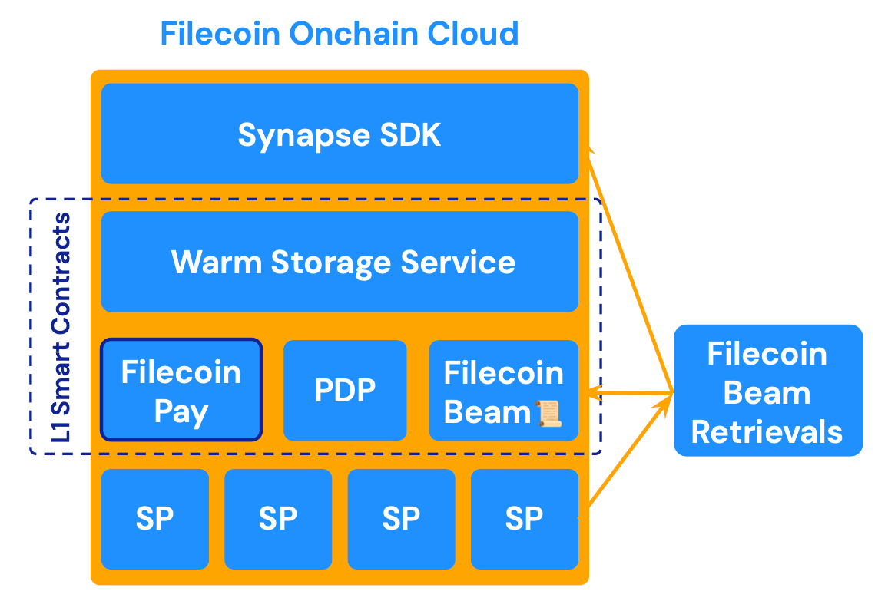

Since its launch, [**Filecoin Network**](https://filecoin.io/) has been the backbone for **decentralized data storage**, anchored by its *Proof-of-Replication (PoRep)* model that ensures the integrity of long-term, immutable data. However, as decentralized applications evolve, they demand **faster access, dynamic payments, and cryptographic verification** that can operate within smart contracts.

[**Filecoin Onchain Cloud (FOC)**](https://www.filecoin.cloud/) addresses this next-generation demand by reimagining storage as a **programmable cloud service layer** — where each capability (storage, retrieval, billing, verification) exists as a composable onchain module. These modules can be combined, forked, or extended, giving builders the flexibility to create customized decentralized applications and data-driven services.

Built on the **Filecoin Virtual Machine (FVM)** and powered by a distributed network of verifiable storage providers, Filecoin Onchain Cloud transforms the Filecoin Network from a large-scale cold storage layer into a programmable, service-based data infrastructure. 

Ready to build? [Get started with the Synapse SDK →](/getting-started/)

## Architecture

FOC addresses this next-generation demand by creating composable onchain services where each capability (storage, retrieval, compute, payments, verification) can be combined, forked, or extended, giving developers the flexibility to create customized decentralized applications and data-driven services. It is built around four fundamental layers:

1. **Storage Layer** – Provided by decentralized service providers using the Filecoin Warm Storage Service (FWSS), optimized for accessibility and speed through crytographic storage proof, Proof of Data Possession (PDP)..
2. **Data Delievery Layer** – Provided by storage provides and an optional add-on service -Filecoin Beam. Filecoin Beam is an incentivized data delievery layer that caches data from storage providers and enables faster data delivery globally with onchain auditable delivery proofs and pay-by-egress billing.
3. **Payment & Settlement Layer** – Managed by Filecoin Pay, enabling flexible, auditable billing flows between clients and providers, based on actual service delievered.
4. **Developer & Application Layer** – Powered by the Synapse SDK, which abstracts services and payment rails into simple APIs usable across web, node, and edge environments.

### Key Properties

At its core, Filecoin Onchain Cloud delivers cloud-grade performance and usability with verifiable onchain properties:

- 🔑 **Ownership** — Data, payments, and service logic belong to users and developers, not intermediaries.
- 🔍 **Verifiability** — Every transaction, proof, and interaction is recorded, auditable, and cryptographically verifiable on the Filecoin blockchain.
- ⚙️ **Programmability** — Services are governed by smart contracts that developers can compose, automate, or extend to suit diverse application needs.

This design allows Filecoin to move beyond static data storage — offering real-time data services, decentralized payment flows, and programmable access policies that any developer can integrate through a unified interface.

### Core Components

The Filecoin Onchain Cloud offers foundational components that together create an onchain verifiable, service-oriented cloud stack. Today, the building blocks includes:

- [**Filecoin Warm Storage Service (FWSS)**](https://github.com/FilOzone/filecoin-services) — The operational layer providing fast, persistent, and verifiable data storage backed by Proof of Data Possession, powered by Filecoin's world storage providers.
- [**Proof of Data Possession (PDP)**](https://github.com/FilOzone/pdp) — The cryptographic storage proof ensuring data storage integrity and availability.
- [**Filecoin Pay**](https://github.com/FilOzone/filecoin-pay) — The financial settlement engine that enables programmable payments for onchain services.
- [**Filecoin Beam**](https://docs.filbeam.com/) — Available as an add-on, a retrieval and delivery layer that ensures global accessibility of stored data.

Each of these components works independently yet integrates seamlessly through onchain smart contracts and the [**Synapse SDK**](https://github.com/FilOzone/synapse-sdk), forming a cohesive, modular system. Together, they deliver the core properties of a next-generation decentralized cloud: verifiability, programmability, and composability.

### Key Products
The **Filecoin Onchain Cloud** is not just an infrastructure layer — it’s a platform for innovation.
By exposing verifiable storage, retrieval, and payment capabilities as onchain services, FOC empowers developers to build entirely new products and workflows to expand the functionality of the Onchain Cloud and bring Filecoin closer to becoming a **modular, decentralized cloud** ecosystem.

#### Filecoin Pin
**Filecoin** Pin is a fully decentralized persistence layer for IPFS content using the global network of Filecoin storage providers with cryptographic guarantees. It brings **IPFS's filesystem structure to Filecoin Onchain Cloud** for developers building on IPFS who need trustless, economically-incentivized persistence for their content.

[Learn more about Filecoin Pin →](https://docs.filecoin.io/builder-cookbook/filecoin-pin)

*More products will be built to extending the capability of the Filecoin Onchain Cloud.*

### Pricing

The **Filecoin Onchain Cloud (FOC)** offers transparent and verifiable pricing for its **Filecoin Warm Storage Service (FWSS)** and **Filecoin Beam** retrieval layer.
All payments are settled automatically through Filecoin Pay, ensuring on-chain accountability and proof-linked billing.

| **Service** | **Pricing** | **Description** |
|-------|---------|--------------------|
| **Base Storage & Retrival** | **$2.5/TiB/month/copy** (minimum 2 copies) | Redundant storage ensures durability and continuous PDP verification. Minimum monthly charge of **0.06 USDFC**, covering roughly **24 GiB** of total data (two copies). |
| **Add-on Retrieval (Filecoin Beam)**  | **Up to $0.014/GiB egress** | Charged for outbound data delivered via Filecoin Beam gateways or retrieval providers. |

:::note[Verifiable Payment]
All storage and retrieval charges are denominated in **USDFC** (or supported ERC-20 tokens) and settled via **Filecoin Pay**. Every transaction is on-chain, auditable, and linked to verifiable service proofs.
:::
